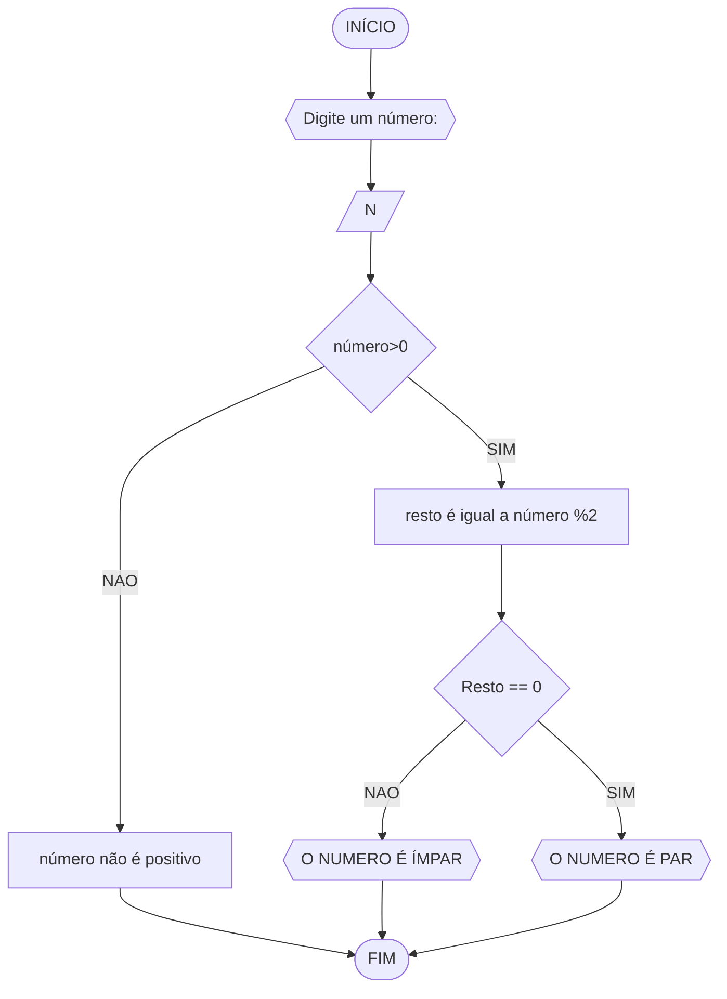

# UNIFOR
**Nome**: Davi de Cerqueira
**Disciplina**: Raciocínio lógico algoritmo

## Exercício 3
## fluxograma


### Pseudocódigo
```
1  ALGORITMO verifica_par_impar
2  DECLARE numero, resto NUMERICO
3  ESCREVA "Digite o número:"
4  LEIA numero
5  SE numero > 0 ENTAO
6    resto = numero % 2
7    SE resto == 0 ENTAO
8      ESCREVA "O número é par"
9    SENAO
10     ESCREVA "O número é impar"
11  SENAO
12   ESCREVA "O número não é positivo"
13  FIM_ALGORITMO
```


