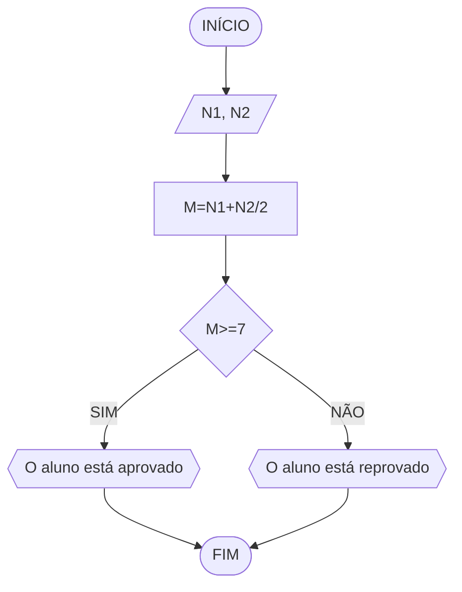
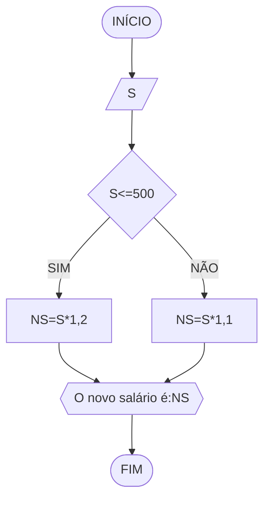
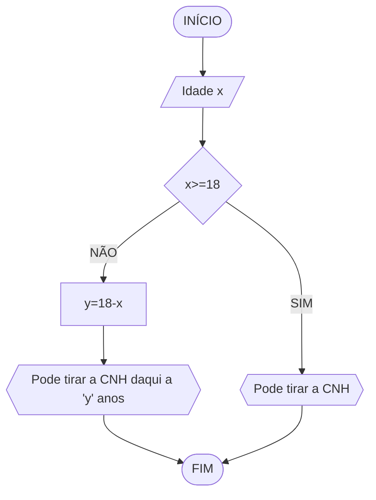

# UNIFOR
**Nome**: Davi de Cerqueira
**Disciplina**: Raciocínio lógico algoritmo

## Exercício 1
## Fluxograma


### pseudocódigo
```
ALGORITMO
DECLARE N1, N2, M NUMÉRICO
ESCREVA "Digite dois números:"
LEIA N1,N2
M ← (N1+N2)/2
SE M>=7
    ESCREVA "Aluno aprovado"
SENÃO
    ESCREVA "Aluno reprovado"
ALGORITMO_FIM
```
## Exercício 2
## Fluxograma


### pseudocódigo
```
ALGORITMO 
DECLARE S, NS NUMÉRICO
ESCREVA "Digite salário atual:"
LEIA S
SE S<=500
   ENTAO NS ← S*1,2
SENÃO
   NS ← S*1,1
ESCREVA "Novo salário:", NS
ALGORITMO_FIM
```
## Exercício 3
## fluxograma


### Pseudocódigo
```
1  ALGORITMO verifica_par_impar
2  DECLARE numero, resto NUMERICO
3  ESCREVA "Digite o número:"
4  LEIA numero
5  SE numero > 0 ENTAO
6    resto = numero % 2
7    SE resto == 0 ENTAO
8      ESCREVA "O número é par"
9    SENAO
10     ESCREVA "O número é impar"
11  SENAO
12   ESCREVA "O número não é positivo"
13  FIM_ALGORITMO
```
## Exercício 4
## Fluxograma


### pseudocódigo
```
ALGORITMO
DECLARE X NUMÉRICO
ESCREVA "Digite a idade:"
LEIA X
SE X>=18
   ESCREVA "Pode tirar a CNH"
SENAO
   Y ← 18 - X
   ESCREVA "Poderá tirar a CNH daqui", y ano(s)
ALGORITMO_FIM
```
```

