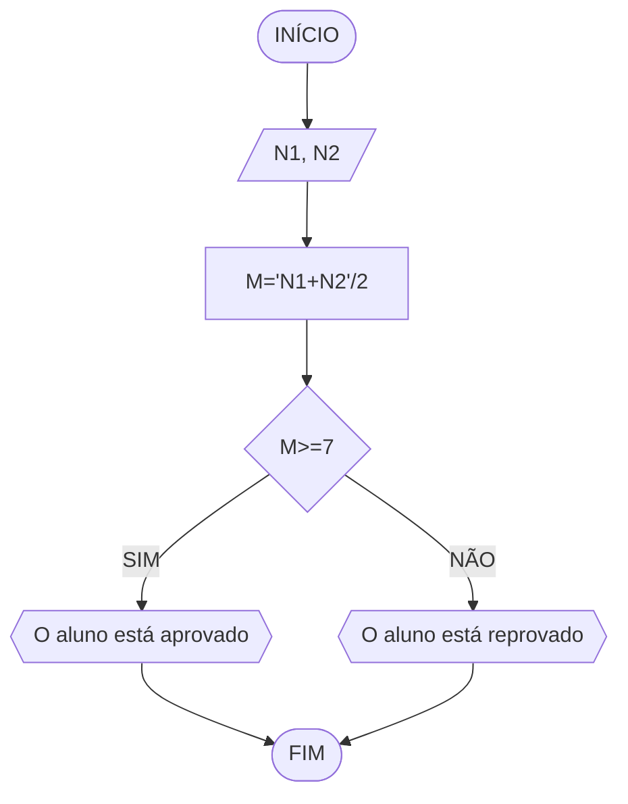
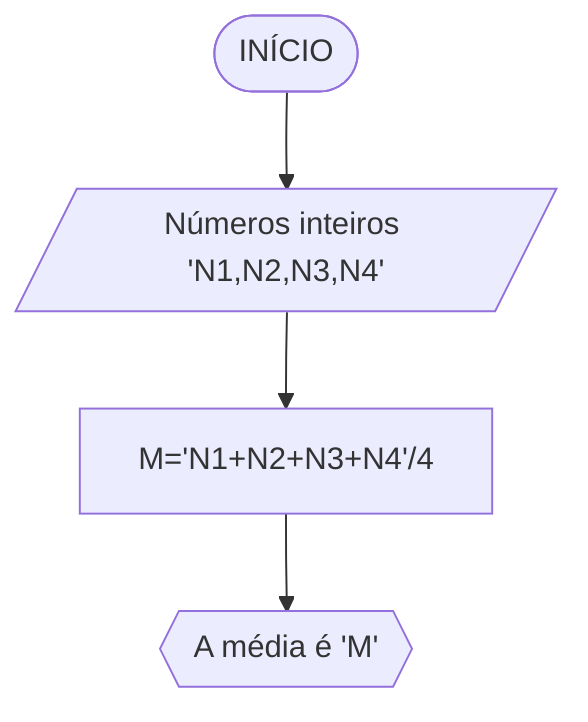
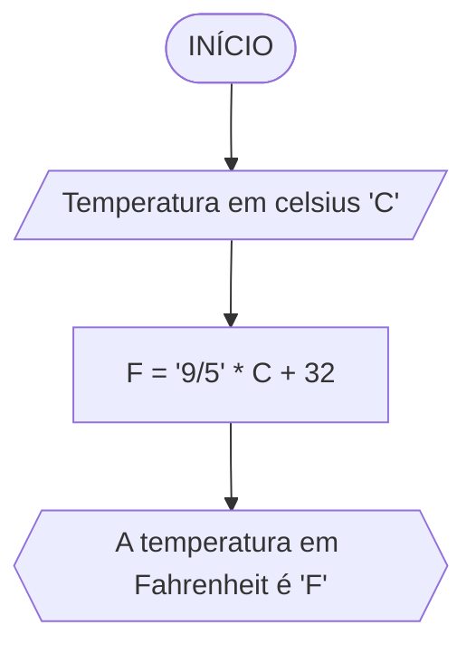
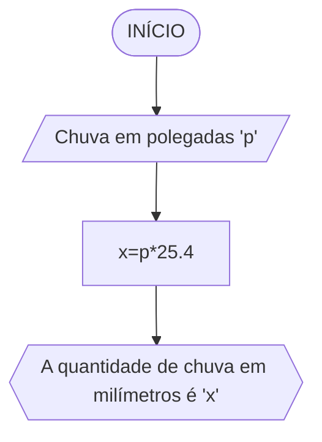

# UNIFOR
**Nome**: Davi de Cerqueira
**Disciplina**: Raciocínio lógico algoritmo

## Exercício 1
## Fluxograma


### pseudocódigo
```
ALGORITMO
DECLARE N1, N2, M NUMÉRICO
ESCREVA "Digite dois números:"
LEIA N1,N2
M ← (N1+N2)/2
SE M>=7
    ESCREVA "Aluno aprovado"
SENÃO
    ESCREVA "Aluno reprovado"
ALGORITMO_FIM
```
## Exercício 2
## Fluxograma


### pseudocódigo
```
ALGORITMO 
DECLARE S, NS NUMÉRICO
ESCREVA "Digite salário atual:"
LEIA S
SE S<=500
   ENTAO NS ← S*1,2
SENÃO
   NS ← S*1,1
ESCREVA "Novo salário:", NS
ALGORITMO_FIM
```
## Exercício 3
## fluxograma


### Pseudocódigo
```
1  ALGORITMO verifica_par_impar
2  DECLARE numero, resto NUMERICO
3  ESCREVA "Digite o número:"
4  LEIA numero
5  SE numero > 0 ENTAO
6    resto = numero % 2
7    SE resto == 0 ENTAO
8      ESCREVA "O número é par"
9    SENAO
10     ESCREVA "O número é impar"
11  SENAO
12   ESCREVA "O número não é positivo"
13  FIM_ALGORITMO
```
## Exercício 4
## Fluxograma


### pseudocódigo
```
ALGORITMO
DECLARE X NUMÉRICO
ESCREVA "Digite a idade:"
LEIA X
SE X>=18
   ESCREVA "Pode tirar a CNH"
SENAO
   Y ← 18 - X
   ESCREVA "Poderá tirar a CNH daqui", y ano(s)
ALGORITMO_FIM
```
## Exercício 5
## Fluxograma


### pseudocódigo
```
ALGORITMO calcMedia
DECLARE N1,N2,N3,N4: inteiro
        M: real positivo
INICIO
ESCREVA "Digite 4 números inteiros:",N1,N2,N3,N4
LEIA N1,N2,N3,N4
M←'N1+N2+N3+N4'/4
ESCREVA "A média é:", M
FIM
```
### teste
```
| N1 | N2 | N3 | N4 | M | Saída |
| -- | -- | -- | -- | -- | -- |
| 12 | 12 | 14 | 16 | 13.5 | “A média é: 13.5“ |
| 2 | 6 | 8 | 4 | 5 | “A média é: 5“ |
| 20 | 30 | 60 | 40 | 37.5 | “A média é: 37.5“ |
```
## Exercício 6
## Fluxograma


### pseudocódigo
```
ALGORITMO calcTemp
DECLARE C,F: real       
INICIO
ESCREVA "Digite a temperatura em Celsius:", C
LEIA C
F ← '9/5' * C + 32
ESCREVA "A temperatura em Fahrenheit é:", F
FIM
```
### teste
```
| C | F | Saída |
| -- | -- | -- | 
| 30 | 86 | "A temperatura em Fahrenheit é: 86" | 
| 22 | 71.6 | "A temperatura em Fahrenheit é: 71.6" |  
| 12 | 53.6 | "A temperatura em Fahrenheit é: 53.6" | 
```
## Exercício 7
## Fluxograma


### pseudocódigo
```
ALGORITMO calcMilim
DECLARE p,x: real positivo       
INICIO
ESCREVA "Digite a quantidade de chuva em polegadas:", p
LEIA p
x ← p*25.4
ESCREVA "A quantidade de chuva em milímetros é:", "x"mm
FIM
```
### teste
```
| p | x | Saída |
| -- | -- | -- | 
| 10 | 254 | "A quantidade de chuva em milímetros é: 254mm" | 
| 4 | 101.6 | "A quantidade de chuva em milímetros é: 101.6mm" |  
| 2 | 50.8 | "A quantidade de chuva em milímetros é: 50.8mm" | 
```


