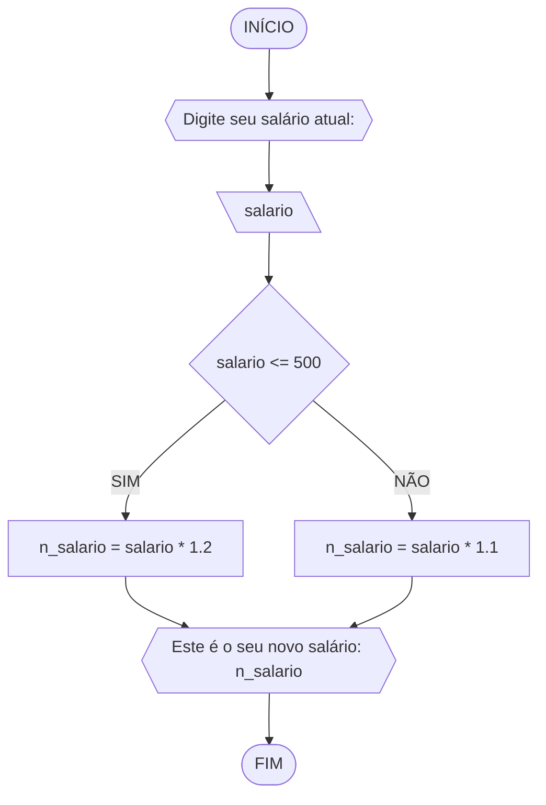

**Curso:** Ciência da Computação <br>
**Disciplina:** Raciocínio Lógico e Algorítmico <br>
**Código/Turma:** T160-39 <br>
**Professor:** Ricardo Carubbi <br>
**Data:** 21/03/2024 <br>
**Aluno(a):** Davi de Cerqueira Esmeraldo <br>
**Matrícula:** 2417684 <br>

# Avaliação Formativa (listas 1, 2 e 3)
## Exercício 01
Objetivo: Represente, em fluxograma e pseudocódigo, um algoritmo para determinar se um número inteiro e positivo é par ou impar.
#### Fluxograma 1.1

#### Pseudocódigo 1.1
```
1  ALGORTIMO verifica_par_impar
2  DECLARE numero, resto: INTEIRO
3  ESCREVA "Digite um número: "
4  INICIO
4  LEIA numero
5  SE numero >= 0 ENTAO                  // verifica se o inteiro é positivo
6    resto = numero % 2                 // calcula o resto da divisão por 2
7    SE resto == 0 ENTAO                // verifica se o resto é igual a zero
8      ESCREVA "O número é par!"
9    SENAO
10     ESCREVA "O número é impar!"
11   FIM_SE
11 SENAO                                // caso inteiro for negativo (condição linha 5)
12    ESCREVA "O número deve ser postivo!"
13 FIM_SE
13 FIM_ALGORITMO
```
#### Teste de mesa 1.1
| numero | numero >= 0 | resto | resto == 0 | Saída |
| -- | -- | -- | -- | -- | 
| -1 | F | - | - | "O número deve ser postivo!" |
| 0  | V | 0 | V | "O número é par!" |
| 13 | V | 1 | F | "O número é impar!" |
| 30 | V | 0 | V | "O número é par!" |

## Exercício 02
Objetivo: Represente, em fluxograma e pseudocódigo, um algoritmo para calcular o novo salário de um funcionário. 
Sabe-se que os funcionários que recebem atualmente salário de até R$ 500 terão aumento de 20%; os demais terão aumento de 10%.
#### Fluxograma 1.2

#### Pseudocódigo 1.2
```
1 ALGORITMO salario
2 DECLARE salario, n_salario NUMERICO
3 ESCREVA "Digite seu salário atual: "
4 LEIA salario
5 SE salario <= 500
6 	ENTÃO n_salario = salario * 1.2
7 SENÃO
8 	n_salario = salario * 1.1
9 FIM_SE
10 ESCREVA "Este é o seu novo salário: "n_salario
11 FIM_ALGORITMO
```
#### Teste de mesa 1.2
| salario | salario <= 500 | n_salario |
|---------|:--------------:|-----------|
| 400     |      True      | 480       |
| 500     |      True      | 600       |
| 600     |      False     | 660       |
| 1000    |      False     | 1100      |

## Exercício 03
Objetivo: Represente, em fluxograma e pseudocódigo, um algoritmo para calcular a média aritmética entre duas notas de um aluno e mostrar sua situação, que pode ser aprovado ou reprovado.
#### Fluxograma 1.3

#### Pseudocódigo 1.3
```
1 ALGORITMO media
2 DECLARE N1, N2, media NUMERICO
3 INÍCIO
4 ESCREVA "Digite dois números"
5 LEIA N1, N2, 
6 media = N1+N2/2
7 SE media >= 7
8 	ENTÃO ESCREVA "Aluno Aprovado"
9 SENÃO ESCREVA "Aluno Reprovado"
10 FIM_SE
11 FIM_ALGORITMO
```
#### Teste de mesa 1.3
| N1 | N2 | media | media >= 7 |      saída      |
|----|----|-------|------------|:---------------:|
| 3  | 4  | 6     | False      | Aluno Reprovado |
| 6  | 7  | 6,5   | False      | Aluno Reprovado |
| 8  | 9  | 8,5   | True       |  Aluno Aprovado |
| 7  | 7  | 7     | True       | Aluno Aprovado  |

## Exercício 04
Objetivo: Represente, em fluxograma e pseudocódigo, um algoritmo que, a partir da idade do candidato(a), determinar se pode ou não tirar a CNH. Caso não atender a restrição de idade, calcular quantos anos faltam para o candidato estar apto.
#### Fluxograma 1.4

#### Pseudocódigo 1.4
```
1 ALGORITMO cnh
2 DECLARE idade, resto NUMERICO
3 INÍCIO
4 ESCREVA "Digite sua idade aqui: "
5 LEIA idade
6 SE idade >= 18
7  ENTÃO ESCREVA "Você está apto a tirar a CNH"
8 SENÃO
9 	resto = 18 - idade
10 	ESCREVA "Falta(m)"resto"ano(s) para 
11 	que possa tirar a CNH"
12  FIM_SE
13 FIM_ALGORITMO
```
#### Teste de mesa 1.4
|    nome   | idade | idade >= 18 | resto |                   saída                   |
|:---------:|:-----:|:-----------:|:-----:|:-----------------------------------------:|
|   Danilo  |   18  |     True    |   -   |        Você está apto a tirar a CNH       |
|   Jorge   |   17  |    False    |   1   |   Falta 1 ano para que possa tirar a CNH  |
| Clarêncio |   5   |    False    |   13  | Faltam 13 anos para que possa tirar a CNH |

## Exercício 01
Objetivo: Calcule a média de quartro números inteiros dados:
### Fluxograma 2.1

### Pseudocódigo 2.1
```
1 ALGORITMO media
2 DECLARE N1, N2, N3, N4, media: int
3 INICIO
4 ESCREVA "Digite quatro números inteiros: "
5 LEIA N1, N2, N3, N4
6 media = (N1+N2+N3+N4)/4
7 ESCREVA "A média é: "media
8 FIM_ALGORITMO
```
### Teste de Mesa 2.1
|N1|N2|N3|N4|somatória| media |
|-|-|-|-|-|-|
|1|5|9|13|28|7
|2|6|10|14|32|8
|3|7|11|15|36|9

## Exercício 02
Objetivo: Leia uma temperatura dada na escala Celsius (C) e imprima o equivalente em Fahrenheit.
### Fluxograma 2.2

### Pseudocódigo 2.2
```
1 ALGORITMO fahrenheit
2 DECLARE celsius, F: real
3 INICIO
4 ESCREVA "Digite a temperatura atual: "
5 LEIA celsius
6 F = (9/5) * celsius + 32
7 ESCREVA "A temperatura em Fahrenheit é: "F
8 FIM_ALGORITMO
```
### Teste de mesa 2.2
|Celsius (C°)|Fahrenheit (F°)|
|      -     |       -       |
|      0     |       32      |
|     20     |       68      |
|     100    |      212      |

## Exercício 03
Objetivo: Receba dois números reais e um operador e efetue a operação correspondente com os valores recebidos (operandos). O algoritmo deve retornar o resultado da operação selecionada simulando todas as operações de uma calculadora simples.
### Fluxograma 2.3

### Pseudocódigo 2.3
```
1 ALGORITMO calculadora
2 DECLARE N1, N2: real
3	op: caractere
4 INÍCIO
5 ESCREVA "Digite dois números: "
6 LEIA N1, N2
7 ESCREVA "Escolha uma das operações [+][-][*][/]: "
8 LEIA op
9 SE op == +
10	ENTÃO CALCULE res = N1 + N2
11	ESCREVA res
12 SENÃO SE op == -
13 	ENTÃO CALCULE res = N1 - N2
14 	ESCREVA res
15 SENÃO SE op == *
16 	ENTÃO CALCULE res = N1 * N2
17 	ESCREVA res
18 SENÃO SE op == /
19 	ENTÃO CALCULE res = N1 / N2
20 		SE N2 != 0
21 			ENTÃO CALCULE res = N1 / N2
22 			ESCREVA res
23 		SENÃO ESCREVA "Digite um número maior que zero"
24 		FIM_SE
25 FIM_SE
26 FIM_ALGORITMO
```
### Teste de mesa 2.3
| N1 | N2 | op | op == + | op == - | op == * | op == / | N2 != 0 | Saída                           |
|----|----|----|---------|---------|---------|---------|:-------:|---------------------------------|
| 10 | 1  | +  | True    | False   | False   | False   |    -    | 11                              |
| 11 | 2  | -  | False   | True    | False   | False   |    -    | 9                               |
| 12 | 3  | *  | False   | False   | True    | False   |    -    | 36                              |
| 13 | 4  | /  | False   | False   | False   | True    |   True  | 3,25                            |
| 14 | 0  | /  | False   | False   | False   | True    |  False  | Digite um número maior que zero |

## Exercício 04
Objetivo: Elaborar um algoritmo que, dada a idade, classifique nas categorias: infantil A (5 - 7 anos), infantil B (8 -10 anos), juvenil A (11 - 13 anos), juvenil B (14 -17 anos) e adulto (maiores que 18 anos).
### Fluxograma 2.4

### Pseudocódigo 2.4
```
1 ALGORITMO idades
2 DECLARE id: int
3 INICIO
4 ESCREVA "Digite a sua idade: "
5 LEIA id
6 SE id <= 4
7 	ENTÃO ESCREVA "Digite uma idade maior que 4"
8 SENÃO SE 5 >= id <= 7
9 	ENTÃO ESCREVA "Você está no infantil A"
10 SENÃO SE 8 >= id <= 10
11 	ENTÃO ESCREVA "Você está no infantil B"
12 SENÃO SE 11 >= id <= 13
13 	ENTÃO ESCREVA "Você está no juvenil A"
14 SENÃO SE 14 >= id <= 17
15 	ENTÃO ESCREVA "Você está no juvenil B"
16 SENÃO ESCREVA "Você está na categoria adulto"
17 FIM_SE
18 FIM_ALGORITMO
```
### Teste de mesa 2.4
| id | id <= 4 | 5 >= id <= 7 | 8 >= id <= 10 | 11 >= id <= 13 | 14 >= id <= 17 | saída                         |
|----|---------|--------------|---------------|----------------|----------------|-------------------------------|
| 3  | True    | False        | False         | False          | False          | Digite uma idade maior que 4  |
| 7  | False   | True         | False         | False          | False          | Você está no infantil A       |
| 10 | False   | False        | True          | False          | False          | Você está no infantil B       |
| 12 | False   | False        | False         | True           | False          | Você está no juvenil A        |
| 17 | False   | False        | False         | False          | True           | Você está no juvenil B        |
| 20 | False   | False        | False         | False          | False          | Você está na categoria adulto |

## Exercício 01
Objetivo: Atualize o algoritmo para determinar se um número inteiro e positivo é par ou ímpar, usando uma laço condicional para aceitar apenas números maiores ou iguais a zero.
### Fluxograma 3.1

### Pseodocódigo 3.1
```
1 ALGORITMO impar_par
2 DECLARE n: int
3 INICIO
4 ESCREVA "digite um numero"
5 LEIA n
6 SE n<0 ENTÃO
7	ENTÃO ESCREVA "Digite um numero positivo: "
8 SENÃO SE (n%2==0) ENTÃO
9 	ENTÃO ESCREVA "Este número é par."
10 SENÃO ESCREVA "Este número é impar"
11 FIM_SE
12 FIM_ALGORITMO
```
### Teste de mesa 3.1
| entrada | negativo | positivo | impar | par | saida |
|--|--|--|--|--|--|
| 1 | nao | sim | sim | nao| impar|
| 2 |nao | sim | nao | sim| par|
| 12 |nao | sim | nao | sim| par|
| -1 | sim | nao |  | | numero negativo|

## Exercício 02
Objetivo: Faça um algoritmo que exiba na tela uma contagem de 0 até 30, exibindo apenas os múltiplos de 3.
### Fluxograma 3.2

### Pseudocódigo 3.2
```
1 ALGORITMO multiplo
2 DECLARE i: int
3 INICIO
4 LEIA i = 0
5 PARA i DE 0 ATÉ 30 [PASSO 3] FAÇA
6 	ESCREAVA i
7 FIM_PARA
8 FIM_ALGORITMO
```
### Teste de mesa 3.2
|etapa 1|etapa 2|etapa 3|etapa 4|etapa 5|etapa 6|etapa 7|etapa 8|etapa 9|etapa 10|etapa 11|
|-|-|-|-|-|-|-|-|-|-|-|
0|3|6|9|12|15|18|21|24|27|30

## Exercício 03
Objetivo: Dada uma sequência de números inteiros, calcular a sua soma. Por exemplo, para a sequência {12, 17, 4, -6, 8, 0}, o seu programa deve escrever o número 35.
### Fluxograma 3.3 

### Pseudocódigo 3.3
```
ALGORITMO soma
DECLARE n, soma: NUMERICO
INICIO
ESCREVA "digite um numero"
LEIA n
soma<--0
	ENQUANTO (n!=0) FAÇA
		soma=+n
		ESCREVA "digite um numero"
		LEIA n
	FIM_ENQUANTO
	ESCREVA soma
FIM_ALGORITMO
```
### Teste de mesa 3.3
ordem|numero|n!=0|soma|saída
-|-|-|-|-
1|1|sim|1
2|2|sim|3
3|3|sim|6
4|4|sim|10
5|0|não|10|10

## Exercício 04
Objetivo: Escreva um programa que leia a nota de diversos alunos, até que seja digitada uma nota negativa. Nesse momento, ele mostra a média aritmética de todas as notas lidas e quantas notas foram lidas. Ex. Foram lidas 14 notas. A média aritmética é 6.75!
### Fluxograma 3.4

### Pseudocodigo 3.4
```
ALGORITMO media
DECLARE n, a, soma: NUMERICO
INICIO
soma <-- 0
a <-- 0
ESCREVA "digite uma nota"
LEIA n
	SE (n>=0) ENTÃO
		soma <-- +n
		a <-- +1
		ESCREVA "digite uma nota"
		LEIA n
	SENÃO 
		ESCREVA soma/a
	FIM_SE 
FIM_ALGORITMO
```
### Teste de mesa 3.4
nota | é >=0 | soma | a | saída
-|-|-|-|-
8|sim|8|1
7|sim|15|2
9|sim|24|3
5|sim|29|4
9|sim|38|5
-3|nao|38|5|7.6

# Avaliação Diagnóstica
## Questão 1
Objetivo: Dadas duas variáveis, a e b, implemente e teste um algoritmo para trocar os valores atribuídos a elas.
### Fluxograma 1

### Pseudocódigo 1
```
1 ALGORITMO valores
2 INICIO
3 ESCREVA "Digite o valor de a: "
4 LEIA a
5 ESCREVA "Digite o valor da b: "
6 LEIA b
7 a = aux
8 a = b
9 b = aux
10 ESCREVA "a =", a
11 ESCREVA "b =", b
```
#### Teste de mesa 1
| a  | b  | aux | a  | b  | saída 1 | saída 2 | 
| -- | -- | --  | -- | -- | --      | --      | 
| 0  | 1  | 0   | 1  | 0  | a = 1   | b = 0   |

## Questão 2
Objetivo: Dado um conjunto n de notas de alunos em um exame, implemente e teste um algoritmo para fazer uma contagem do número de alunos que foram aprovados no exame. Será considerado aprovado o aluno que tirar nota 50 ou maior (no intervalo de 0 a 100).
### Fluxograma 2

### Pseudocódigo 2
```
1 ALGORITMO notas
2 DECLARE n, i, cont: int
3 INICIO
4 ESCREVA "Digite o número de alunos: "
5 LEIA n
6 cont = 0
7 i = 1
8 SE i <= n
9   ENTÃO ESCREVA "Digite a nota do aluno, i"
10   LEIA nota
11   SE nota >= 50 E nota <=100
12      cont =+ 1
13      i =+ 1
14    SENÃO i =+ 1
15    FIM_SE
16 SENÃO ESCREVA "Número de alunos aprovados: cont"
17 FIM_SE  
18 FIM_ALGORITMO
```
### Teste de mesa 2
| it | n  | i  | cont | i<=n  | nota, i | nota | nota_valida | cont+1 | i+1 | saída        | 
| -- | -- | -- | --   | --    | --      | --   | --          | --     | --  | --           |
| 1  | 3  | 1  |  0   | True  | nota 1  | 60   | True        | 1      | 2   |              |
| 2  | 3  | 2  |  1   | True  | nota 2  | 40   | False       | 1      | 3   |              |
| 3  | 3  | 3  |  1   | True  | nota 3  | 90   | True        | 2      | 4   |              |
| 4  | 3  | 4  |  2   | False |         |      |             |        |     | Aprovados: 2 |

## Questão 3
Objetivo:
### Fluxograma 3

### Pseudocódigo 3
```
1 ALGORITMO contagem
2 DECLARE n
3 INICIO
4 ESCREVA "Digite a quantidade de números<br> (n >= 0):"
5 LEIA n
6 SE n >= 0
7   ENTAO soma = 0
8   i = 1
9   SE i <= n
10     ENTAO ESCREVA "Digite um número: "
11     LEIA num
12     soma =+ num
13     i =+ 1
14  SENÃO ESCREVA "A soma dos numeros é , soma"
15  FIM_SE 
16 SENÃO ESCREVA "O valor deve ser maior ou igual a zero!"
17 FIM_SE
18 FIM_ALGORITMO
```
### Teste de mesa 3
| it | n  | n >= 0 | soma | i  | i <= n | num | soma =+ num  | saída                   |
| -- | -- | --     | --   | -- | --     | --  | --           | --                      |
|    | -3 | False  |      |    |        |     |              | O valor deve ser ...    |
| 1  | 0  | True   | 0    | 1  | False  |     |              | A soma dos números é 0  |
| 1  | 3  | True   | 0    | 1  | True   | 5   | 0 + 5 = 5    |                         |
| 2  | 3  | True   | 5    | 2  | True   | 10  | 5 + 10 = 15  |                         |
| 3  | 3  | True   | 15   | 3  | True   | 20  | 15 + 20 = 35 |                         |
| 4  | 3  | True   | 35   | 4  | False  |     |              | A soma dos números é 35 |

## Questão 4
Objetivo:
### Fluxograma 4

### Pseudocódigo 4
```
1 ALGORITMO somaserie
2 DECLARE n, s, i: real
3 INICIO
4 ESCREVA "Digite o número de termos da série S: "
5 LEIA n
6 S = 0
7 PARA <i> DE <0> ATE <n> [PASSO1] FAÇA
8   numerador = 2 * i + 1
9   LEIA numerador
10  denominador = 2 * i + 2
11  LEIA denominador
12  termo = numerador / denominador
13  LEIA termo
14  S += termo
15  FIM_PARA
16 ESCREVA "Soma da série S é ," S
17 FIM_ALGORITMO
```
### Teste de mesa 4
| it | n  | S  | i | numerador | denominador | termo | S += termo     | saída                  |
| -- | -- | -- |-- | --        | --          | --    | --             | --                     |
|    | 0  | 0  |   |           |             |       |                |                        |
| 1  | 4  | 0  | 0 | 2*0+1 = 1 | 2*0+2 = 2   | 1/2   | 0+1/2 = 1/2    |                        |
| 2  | 4  | 0  | 1 | 2*1+1 = 1 | 2*1+2 = 2   | 3/4   | 1/2+3/4 = 1.25 |                        |
| 3  | 4  | 0  | 2 | 2*2+1 = 1 | 2*2+2 = 2   | 5/6   | 0+1/2 = 2.08   |                        |
| 4  | 4  | 0  | 3 | 2*3+1 = 1 | 2*3+2 = 2   | 7/8   | 0+1/2 = 2.96   | Soma da série S é 2.96 |

## Questão 5
Objetivo:
### Fluxograma 5

### Pseudocódigo 5
```
1 ALGORITMO fatorial
2 DECLARE n, i, fator: int
3 INICIO
4 ESCREVA "Digite um numero inteiro nao-negativo:"
5 LEIA n
6 SE n >= 0
7   ENTAO fator = 1
8   PARA <i> DE <1> ATE n PASSO <1> FAÇA
9   LEIA i
10  fator = fator * i
11  LEIA fator
12  FIM_PARA
13 SENÃO ESCREVA "O valor deve ser maior ou igual a zero!"
14 FIM_SE
15 FIM_ALGORITMO
```
### Teste de mesa 5
| n  | fator | i  | fator = fator * i | saída               |
| -- | --    | -- | --                | --                  |
| 3  | 1     | 1  | 1*1 = 1           |                     |
| 3  | 1     | 2  | 1*2 = 2           |                     |
| 3  | 2     | 3  | 2*3 = 6           | O fatorial de 3 é 6 |

## Questão 6
Objetivo:
### Fluxograma 6

### Pseudocódigo 6
```
1 ALGORITMO fibonacci
2 DECLARE n_termos, n, i, a, b, termo_atual: int
3 INICIO
4 ESCREVA "Número de termos da série Fibonacci:"
5 LEIA n_termos
6 a = 0
7 b = 1
8 PARA <i> DE <1> ATE <n> PASSO <1> FAÇA 
9   ESCREVA "a"
10  termo_atual = a + b
11  a = b
12  b = termo_atual
13  FIM_PARA
14 FIM_ALGORITMO
```
### Teste de mesa 6
| it | n  | a  | b  | i  | saída | termo_atual = a + b | a = b | b = termo_atual |
| -- | -- | -- | -- | -- | --    | --                  | --    | --              |
| 1  | 5  | 0  | 1  | 1  | 0     | 0 + 1 = 1           | 1     | 1               |
| 2  | 5  | 1  | 1  | 2  | 1     | 1 + 1 = 2           | 1     | 2               |
| 3  | 5  | 1  | 2  | 3  | 1     | 1 + 2 = 3           | 2     | 3               |
| 4  | 5  | 2  | 3  | 4  | 2     | 2 + 3 = 5           | 3     | 5               |
| 4  | 5  | 3  | 5  | 5  | 3     | 3 + 5 = 8           | 5     | 8               |

## Questão 7
Objetivo: Implemente e teste um algoritmo para inverter a ordem dos dígitos de um número inteiro positivo.
### Fluxograma 7

### Pseudocódigo 7
```
1 ALGORITMO inverter
2 DECLARE num, digito, num_inv: int
3 INICIO
4 ESCREVA "Digite um número inteiro: "
5 LEIA num
6 SE num >= 0 ENTAO
7   num_inv = 0
8   ENQUANTO num > 0 FAÇA
9     digito = num % 10
10    num_inv = num_inv*10 + digito
11    num = num//10
12  FIM_ENQUANTO
13  ESCREVA "Número invertido:", numero_inv
14 SENÃO ESCREVA "O número deve ser positivo!"
15 FIM_SE
16 FIM_ALGORITMO
```
### Teste de mesa 7
| it | num | num_inv | num > 0 | digito | num = num // 10 | num_inv = (num_inv * 10) + digito | Saída                       |
| -- | --  | --      | --     | --      | --              | --                                | --                          |
|    | -1  | 0       | False  |         |                 |                                   | O número deve ser positivo! |
| 1  | 0   | 0       | False  |         |                 |                                   | Número invertido:: 0        |
| 1  | 42  | 0       | True   | 2       | 4               | 2                                 |                             |
| 2  | 4   | 2       | True   | 4       | 0               | 24                                |                             |
| 3  | 0   | 24      | False  |         |                 |                                   | Número invertido:: 24       |
# Avaliação Diagnóstica 1

## Questão 1
Objetivo: Dadas duas variáveis, a e b, implemente e teste um algoritmo para trocar os valores atribuídos a elas.
### Fluxograma 1

### Pseudocódigo 1
```
1 ALGORITMO valores
2 INICIO
3 ESCREVA "Digite o valor de a: "
4 LEIA a
5 ESCREVA "Digite o valor da b: "
6 LEIA b
7 a = aux
8 a = b
9 b = aux
10 ESCREVA "a =", a
11 ESCREVA "b =", b
```
#### Teste de mesa 1
| a  | b  | aux | a  | b  | saída 1 | saída 2 | 
| -- | -- | --  | -- | -- | --      | --      | 
| 0  | 1  | 0   | 1  | 0  | a = 1   | b = 0   |

## Questão 2
Objetivo: Dado um conjunto n de notas de alunos em um exame, implemente e teste um algoritmo para fazer uma contagem do número de alunos que foram aprovados no exame. Será considerado aprovado o aluno que tirar nota 50 ou maior (no intervalo de 0 a 100).
### Fluxograma 2
```mermaid
flowchart TD
A([INICIO]) --> B{{Digite o número de alunos: }}
B --> C[\n\]
C --> D[\cont = 0\]
D --> E[\i = 1\]
E --> F{i <= n}
F --FALSE--> W{{Número de alunos aprovados: cont}}
W --> Z([FIM])
F --TRUE--> G{{Digite a nota do aluno, i}}
G --> H[\nota\]
H --> I{"nota >= 50 <br>E <br>nota <=100"}
I --TRUE--> J[\cont =+ 1\]
I --FALSE--> K[\i =+ 1\]
J --> K
K --LOOP--> F
```
### Pseudocódigo 2
```
1 ALGORITMO notas
2 DECLARE n, i, cont: int
3 INICIO
4 ESCREVA "Digite o número de alunos: "
5 LEIA n
6 cont = 0
7 i = 1
8 SE i <= n
9   ENTÃO ESCREVA "Digite a nota do aluno, i"
10   LEIA nota
11   SE nota >= 50 E nota <=100
12      cont =+ 1
13      i =+ 1
14    SENÃO i =+ 1
15    FIM_SE
16 SENÃO ESCREVA "Número de alunos aprovados: cont"
17 FIM_SE  
18 FIM_ALGORITMO
```
### Teste de mesa 2
| it | n  | i  | cont | i<=n  | nota, i | nota | nota_valida | cont+1 | i+1 | saída        | 
| -- | -- | -- | --   | --    | --      | --   | --          | --     | --  | --           |
| 1  | 3  | 1  |  0   | True  | nota 1  | 60   | True        | 1      | 2   |              |
| 2  | 3  | 2  |  1   | True  | nota 2  | 40   | False       | 1      | 3   |              |
| 3  | 3  | 3  |  1   | True  | nota 3  | 90   | True        | 2      | 4   |              |
| 4  | 3  | 4  |  2   | False |         |      |             |        |     | Aprovados: 2 |

## Questão 3
Objetivo:
### Fluxograma 3
```mermaid
flowchart TD
A([INICIO]) --> B{{"Digite a quantidade de números<br> (n >= 0):"}}
B --> C[\n\]
C --> D{n >= 0}
D --FALSE-->N{{"O valor deve ser maior ou igual a zero!"}}
N --> M([FIM])
D --TRUE--> E[/soma = 0/]
E --> F[i = 1]
F --> G{i <= n}
G --FALSE--> L{{"A soma dos numeros é , soma"}}
L --> M
G --TRUE--> H{{Digite um número: }}
H --> I[\num\]
I --> J[soma =+ num]
J --> K[i =+ 1]
K --LOOP--> G
```
### Pseudocódigo 3
```
1 ALGORITMO contagem
2 DECLARE n
3 INICIO
4 ESCREVA "Digite a quantidade de números<br> (n >= 0):"
5 LEIA n
6 SE n >= 0
7   ENTAO soma = 0
8   i = 1
9   SE i <= n
10     ENTAO ESCREVA "Digite um número: "
11     LEIA num
12     soma =+ num
13     i =+ 1
14  SENÃO ESCREVA "A soma dos numeros é , soma"
15  FIM_SE 
16 SENÃO ESCREVA "O valor deve ser maior ou igual a zero!"
17 FIM_SE
18 FIM_ALGORITMO
```
### Teste de mesa 3
| it | n  | n >= 0 | soma | i  | i <= n | num | soma =+ num  | saída                   |
| -- | -- | --     | --   | -- | --     | --  | --           | --                      |
|    | -3 | False  |      |    |        |     |              | O valor deve ser ...    |
| 1  | 0  | True   | 0    | 1  | False  |     |              | A soma dos números é 0  |
| 1  | 3  | True   | 0    | 1  | True   | 5   | 0 + 5 = 5    |                         |
| 2  | 3  | True   | 5    | 2  | True   | 10  | 5 + 10 = 15  |                         |
| 3  | 3  | True   | 15   | 3  | True   | 20  | 15 + 20 = 35 |                         |
| 4  | 3  | True   | 35   | 4  | False  |     |              | A soma dos números é 35 |

## Questão 4
Objetivo:
### Fluxograma 4
```mermaid
flowchart TD
A([INICIO]) --> B{{Digite o número de termos da série S: }}
B --> C[/n/]
C --> D[S = 0]
D --> E[[i=0 ATE n PASSO 1]]
E --i > n--> J{{"Soma da série S é ", S}}
J --> K([FIM])
E --"i=0,1,2,..,n"--> F[numerador = 2 * i + 1]
F --> G[denominador = 2 * i + 2]
G --> H[termo = numerador / denominador]
H --> I[S += termo]
I --LOOP--> E
```
### Pseudocódigo 4
```
1 ALGORITMO somaserie
2 DECLARE n, s, i: real
3 INICIO
4 ESCREVA "Digite o número de termos da série S: "
5 LEIA n
6 S = 0
7 PARA <i> DE <0> ATE <n> [PASSO1] FAÇA
8   numerador = 2 * i + 1
9   LEIA numerador
10  denominador = 2 * i + 2
11  LEIA denominador
12  termo = numerador / denominador
13  LEIA termo
14  S += termo
15  FIM_PARA
16 ESCREVA "Soma da série S é ," S
17 FIM_ALGORITMO
```
### Teste de mesa 4
| it | n  | S  | i | numerador | denominador | termo | S += termo     | saída                  |
| -- | -- | -- |-- | --        | --          | --    | --             | --                     |
|    | 0  | 0  |   |           |             |       |                |                        |
| 1  | 4  | 0  | 0 | 2*0+1 = 1 | 2*0+2 = 2   | 1/2   | 0+1/2 = 1/2    |                        |
| 2  | 4  | 0  | 1 | 2*1+1 = 1 | 2*1+2 = 2   | 3/4   | 1/2+3/4 = 1.25 |                        |
| 3  | 4  | 0  | 2 | 2*2+1 = 1 | 2*2+2 = 2   | 5/6   | 0+1/2 = 2.08   |                        |
| 4  | 4  | 0  | 3 | 2*3+1 = 1 | 2*3+2 = 2   | 7/8   | 0+1/2 = 2.96   | Soma da série S é 2.96 |

## Questão 5
Objetivo:
### Fluxograma 5
```mermaid
flowchart TD
A([INICIO]) --> B{{"Digite um numero inteiro nao-negativo:"}}
B --> C[/n/]
C --> D{n >= 0}
D --TRUE--> E[fator = 1]
D --FALSE--> J{{O valor deve ser maior ou igual a zero!}}
J --> I([FIM])
E --> F[[i=1 ATÉ n PASSO 1]]
F --"i > n"--> H{{O fatorial de, n, é:, fator}}
F --"i=1,2,..n"--> G[fator = fator * i]
G --LOOP--> F
H --> I
```
### Pseudocódigo 5
```
1 ALGORITMO fatorial
2 DECLARE n, i, fator: int
3 INICIO
4 ESCREVA "Digite um numero inteiro nao-negativo:"
5 LEIA n
6 SE n >= 0
7   ENTAO fator = 1
8   PARA <i> DE <1> ATE n PASSO <1> FAÇA
9   LEIA i
10  fator = fator * i
11  LEIA fator
12  FIM_PARA
13 SENÃO ESCREVA "O valor deve ser maior ou igual a zero!"
14 FIM_SE
15 FIM_ALGORITMO
```
### Teste de mesa 5
| n  | fator | i  | fator = fator * i | saída               |
| -- | --    | -- | --                | --                  |
| 3  | 1     | 1  | 1*1 = 1           |                     |
| 3  | 1     | 2  | 1*2 = 2           |                     |
| 3  | 2     | 3  | 2*3 = 6           | O fatorial de 3 é 6 |

## Questão 6
Objetivo:
### Fluxograma 6
```mermaid
flowchart TD
A([INICIO]) --> B{{"Número de termos da série Fibonacci:"}}
B --> C[a = 0]
C --> D[b = 1]
D --> E[[i=1 ATÉ n PASSO 1]]
E --"i > n"--> J([FIM])
E --"i=1,2,...,n"--> F{{a}}
F --> G[termo_atual = a + b]
G --> H[a = b]
H --> I[b = termo_atual]
I --LOOP--> E 
```
### Pseudocódigo 6
```
1 ALGORITMO fibonacci
2 DECLARE n_termos, n, i, a, b, termo_atual: int
3 INICIO
4 ESCREVA "Número de termos da série Fibonacci:"
5 LEIA n_termos
6 a = 0
7 b = 1
8 PARA <i> DE <1> ATE <n> PASSO <1> FAÇA 
9   ESCREVA "a"
10  termo_atual = a + b
11  a = b
12  b = termo_atual
13  FIM_PARA
14 FIM_ALGORITMO
```
### Teste de mesa 6
| it | n  | a  | b  | i  | saída | termo_atual = a + b | a = b | b = termo_atual |
| -- | -- | -- | -- | -- | --    | --                  | --    | --              |
| 1  | 5  | 0  | 1  | 1  | 0     | 0 + 1 = 1           | 1     | 1               |
| 2  | 5  | 1  | 1  | 2  | 1     | 1 + 1 = 2           | 1     | 2               |
| 3  | 5  | 1  | 2  | 3  | 1     | 1 + 2 = 3           | 2     | 3               |
| 4  | 5  | 2  | 3  | 4  | 2     | 2 + 3 = 5           | 3     | 5               |
| 4  | 5  | 3  | 5  | 5  | 3     | 3 + 5 = 8           | 5     | 8               |

## Questão 7
Objetivo: Implemente e teste um algoritmo para inverter a ordem dos dígitos de um número inteiro positivo.
### Fluxograma 7
```mermaid
flowchart TD
A([INICIO]) --> B{{Digite um número inteiro: }}
B --> C[\num\]
C --> D{num >= 0}
D --TRUE--> G[num_inv = 0]
G --> H{num > 0}
H --FALSE--> Z{{"Número invertido:", numero_inv}}
Z --> W([FIM])
H --TRUE--> I[digito = num % 10]
I --> J[num_inv = num_inv * 10 + digito]
J --> K[numero = numero // 10]
K --LOOP--> H
D --FALSE--> E{{O número deve ser positivo!}}
E --> W
```
### Pseudocódigo 7
```
1 ALGORITMO inverter
2 DECLARE num, digito, num_inv: int
3 INICIO
4 ESCREVA "Digite um número inteiro: "
5 LEIA num
6 SE num >= 0 ENTAO
7   num_inv = 0
8   ENQUANTO num > 0 FAÇA
9     digito = num % 10
10    num_inv = num_inv*10 + digito
11    num = num//10
12  FIM_ENQUANTO
13  ESCREVA "Número invertido:", numero_inv
14 SENÃO ESCREVA "O número deve ser positivo!"
15 FIM_SE
16 FIM_ALGORITMO
```
### Teste de mesa 7
| it | num | num_inv | num > 0 | digito | num = num // 10 | num_inv = (num_inv * 10) + digito | Saída                       |
| -- | --  | --      | --     | --      | --              | --                                | --                          |
|    | -1  | 0       | False  |         |                 |                                   | O número deve ser positivo! |
| 1  | 0   | 0       | False  |         |                 |                                   | Número invertido:: 0        |
| 1  | 42  | 0       | True   | 2       | 4               | 2                                 |                             |
| 2  | 4   | 2       | True   | 4       | 0               | 24                                |                             |
| 3  | 0   | 24      | False  |         |                 |                                   | Número invertido:: 24       |
