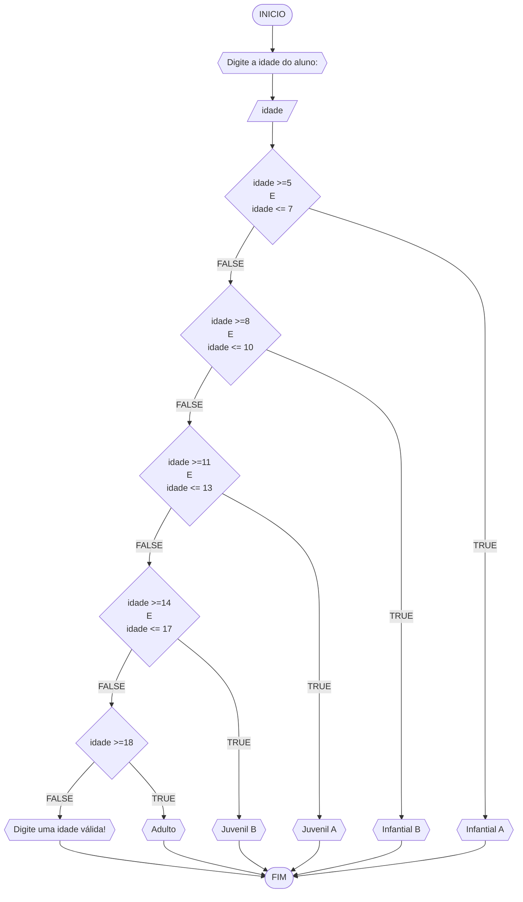

**Curso:** Ciência da Computação <br>
**Disciplina:** Raciocínio Lógico e Algorítmico <br>
**Código/Turma:** T160-39 <br>
**Professor:** Ricardo Carubbi <br>
**Data:** 03/04/2024 <br>
**Aluno(a):** Davi de Cerqueira Esmeraldo <br>
**Matrícula:** 2417684 <br>

# Avaliação Formativa (listas 1, 2 e 3)
## Lista de exercícios 01

### Exercício 01 
Represente, em fluxograma e pseudocódigo, um algoritmo para determinar se um número inteiro e positivo é par ou impar.

#### Fluxograma


#### Pseudocódigo
```java
ALGORTIMO verifica_par_impar
DECLARE numero, resto: INTEIRO

INICIO

    // Entrada do usuário com um número inteiro
    ESCREVA "Digite um número: "
    
    // Armazena o número dado pelo usuário
    LEIA numero
    
    // Executa as intruções sob a condição "numero >= 0" for verdadeira
    SE numero >= 0 ENTAO

        // Calcula o resto da divisão de "numero" por 2
        resto <- numero % 2

        // Executa a instrução se o resto é igual a zero
        SE resto == 0 ENTAO
            ESCREVA "O número é par!"

        // Executa a instrução se o resto não é igual a zero
        SENAO
          ESCREVA "O número é impar!"

        FIM_SE

    // Executa as intruções sob a condição "numero >= 0" for falsa
    SENAO             
        ESCREVA "O número deve ser postivo!"

    FIM_SE

FIM
```

#### Tabela de testes 
| numero | numero >= 0 | resto | resto == 0 | Saída |
| -- | -- | -- | -- | -- | 
| -1 | F |   |   | "O número deve ser postivo!" |
| 0  | V | 0 | V | "O número é par!" |
| 13 | V | 1 | F | "O número é impar!" |
| 30 | V | 0 | V | "O número é par!" |

## Exercício 02 
Represente, em fluxograma e pseudocódigo, um algoritmo para calcular o novo salário de um funcionário. 
Sabe-se que os funcionários que recebem atualmente salário de até R$ 500 terão aumento de 20%; os demais terão aumento de 10%.

#### Fluxograma 


#### Pseudocódigo

```java
ALGORTIMO ReajusteSalario
DECLARE sal_atual, sal_reaj: REAL

INICIO

    // Variável sal_atual como dado de entrada
    ESCREVA "Digite seu salário atual:"

    // Armazena o valor de entrada na variável "sal_atual"
    LEIA sal_atual

    // Executa as instruções sob a condição "sal_atual <= 500" for verdadeira
    SE sal_atual <= 500 ENTAO
        sal_reaj = sal_atual * 1.2

    // Executa as instruções sob a condição "sal_atual <= 500" for falsa
    SENAO
        sal_reaj = sal_atual * 1.1

    FIM_SE

    // Exibe a mensagem relativa ao novo salário
    ESCREVA "O novo salário é R$", sal_reaj

FIM
```

#### Tabela de testes (1.0 ponto)

| sal_atual | sal_atual >= 500 |sal_reaj       | saída                   | 
| --        | --               | --            | --                      | 
| 400       | False            | 400*1.2 = 480 | O novo salário é R$ 480 |
| 500       | True             | 500*1.2 = 600 | O novo salário é R$ 600 |
| 600       | True             | 600*1.1 = 660 | O novo salário é R$ 660 |

## Exercício 03 
Represente, em fluxograma e pseudocódigo, um algoritmo para calcular a média aritmética entre duas notas de um aluno e mostrar sua situação, que pode ser aprovado ou reprovado.

#### Fluxograma 


#### Pseudocódigo 

```java
ALGORTIMO SituacaoAluno
DECLARE nota1, nota2, media: REAL

INICIO

    // Variável "nota1" como dado de entrada
    ESCREVA "Digite a nota 1:"

    // Armazena o valor do dado de entrada na variável "nota1"
    LEIA nota1

    // Entrada do usuário com outra variável, a "nota2"
    ESCREVA "Digite a nota 2:"

    // Armazena o valor do dado de entrada na variável "nota2"
    LEIA nota2

    // Executa as intruções para caso "nota1 >= 0 E nota2 >= 0" for verdadeiro
    SE nota1 >= 0 E nota2 >= 0 ENTAO
        media =  (nota1 + nota2)/2

        // Executa as intruções para caso "media >= 7" for verdadeiro
        SE media >= 7 ENTAO
            ESCREVA "O aluno está aprovado!"

        // Executa as intruções para caso "media >= 7" for falso
        SENAO
            "O aluno está reprovado!"

        FIM_SE

    // Executa as intruções para caso "nota1 >= 0 E nota2 >= 0" for falso
    SENAO
        ESCREVA "A nota deve ser maior que zero!"

    FIM_SE

FIM
```

#### Tabela de testes 

| nota1 | nota2 | nota1 >= 0 E nota2 >= 0 | media        | saĩda | 
| --    | --    | --                      | --           | --    | 
| -1    | 0     | False                   |              | A nota deve ser maior que zero! | 
| 0     | 0     | True                    | (0+0)/2 = 0  | O aluno está reprovado!|
| 4     | 8     | True                    | (4+8)/2 = 6  | O aluno está reprovado!|
| 4     | 10    | True                    | (4+10)/2 = 7 | O aluno está aprovado!|

## Exercício 04 
Represente, em fluxograma e pseudocódigo, um algoritmo que, a partir da idade do candidato(a), determinar se pode ou não tirar a CNH. 
Caso não atender a restrição de idade, calcular quantos anos faltam para o candidato estar apto.

#### Fluxograma 


#### Pseudocódigo

```java
ALGORTIMO AptoCNH
DECLARE idade, anos_apto: INTEIRO

INICIO

    // Entrada de dados pelo usuário com um número inteiro 
    ESCREVA ""Digite a sua idade:"

    // Armezena o número dado na variável "idade"
    LEIA idade

    // Executa as instruções caso "idade < 0" for verdadeiro
    SE idade < 0 ENTAO
        ESCREVA "A idade deve ser maior que zero!"

    // Executa as instruções caso "idade < 0" for falso
    SENAO

        // executa as instruções caso "idade < 0" for falso e "idade >= 18" for verdadeiro
        SE idade >= 18 ENTAO
            ESCREVA "O candidato está apto a tirar a CNH!"

        // executa as instruções caso "idade < 0" for falso e "idade >= 18" for falso
        SENAO

            // Inicializa a variável "anos_apto" com valor de "18 - idade"
            anos_apto <- 18 - idade

            // Exibe mensagem informando quantos anos faltam para que o usuário possa tirar sua CNH
            ESCREVA "Faltam", anos_apto, "ano(s) para o candidato estar apto!"

        FIM_SE

    FIM_SE

FIM
```

#### Tabela de testes 

| idade | idade < 0 | idade >= 18 | anos_apto | saída                                         | 
| --    | --        | --          | --        | --                                            | 
| -1    | True      |             |           |                                               |
| 0     | False     | False       | 18-0 = 18 | Faltam 18 ano(s) para o candidato estar apto! |
| 17    | False     | False       | 18-17 = 1 | Faltam 1 ano(s) para o candidato estar apto!  |
| 18    | False     | True        |           | O candidato está apto a tirar a CNH!          |

## Lista de exercícios 02

### Exercício 01 
Calcule a média de quatro números inteiros dados.

#### Fluxograma


#### Pseudocódigo 

```java
ALGORTIMO Media
DECLARE num1, num2, num3, num4: REAL

INICIO

    // Entrada do usuário com um número real
    ESCREVA "Digite o número 1:"

    // Armazena o dado do usuário na variável "num1"
    LEIA num1

    //Entrada do usuário com um número real
    ESCREVA "Digite o número 2:"

    // Armazena o dado do usuário na variável "num2"
    LEIA num2

    // Entrada do usuário com um número real
    ESCREVA "Digite o número 3:"

    // Armazena o dado do usuário na variável "num3"
    LEIA num3

    // Entrada do usuário com um número real
    ESCREVA "Digite o número 4:"

    // Armazena o dado do usuário na variável "num4"
    LEIA num4

    // Inicializa a variável "media" como "(num1 + num2 + num3 + num4)/4" e exibe a mensagem como saída de dados
    media <- (num1 + num2 + num3 + num4)/4
    ESCREVA "A média é", media

FIM
```

#### Teste de mesa 

| num1 | num2 | num3 | num4 | saída | 
| --   | --   | --   | --   | --    | 
| 0.25 | 0.25 | 2.50 | 1.00 | 1.00  | 

### Exercício 02 
Leia uma temperatura dada em Celsius (C) e imprima o equivalente em Fahrenheit (F). (Fórmula de conversão: F = (9/5) * C + 32)

#### Fluxograma 


#### Pseudocódigo 

```java
ALGORTIMO ConverteCelsiusFarenheit
DECLARE C, F: REAL

INICIO

    // Entrada de dados pelo usuário com uma temperatura em celsius
    ESCREVA "Digite a temperatura em Celisus:"

    // Armazena a temperatura em celsius na variável "C"
    LEIA C

    // Inicializa a varíavel "F" em "(9/5) * C + 32"
    F <- (9/5) * C + 32

    // Exibe a mensagem como saída de dados
    ESCREVA "A temperatura em Fahrenheit é", F, "graus"

FIM
```

#### Teste de mesa 

| C  | F  | saída                                  | 
| -- | -- | --                                     |
| 0  | 32 | A temperatura em Fahrenheit é 32 graus |

### Exercício 03 
Receba dois números reais e um operador e efetue a operação correspondente com os valores recebidos (operandos). 
O algoritmo deve retornar o resultado da operação selecionada simulando todas as operações de uma calculadora simples.

#### Fluxograma 


#### Pseudocódigo (1.0 ponto)

```java
ALGORITMO CalculadoraSimples
DECLARE op: INTEIRO; num1,num2,res: REAL

INICIO

    // Mensagem como saída de dados para informar as operações válidadas e suas devidas variáveis
    ESCREVA "Operações válidas: 1(soma), 2(subtração), 3(multiplicação) e 4(divisão)"

    // Entrada de dados pelo usuário
    ESCREVA "Digite uma operação:"

    // Armazena os dados na variável "op"
    LEIA op

    // Entrada de dados pelo usuário
    ESCREVA "Digite um número:"

    // Armazena os dados informados na variável "num1"
    LEIA num1

    // Entrada de dados pelo usuário
    ESCREVA "Digite outro número:"

    // Armazena os dados informados na variável "num2"
    LEIA num2

    // Estrutura condicional do tipo caso
    ESCOLHA

        // Instruções dos comandos caso "op == 1"
        CASO op == 1

            // Inicializa a variável "res" em "num1 + num2"
            res = num1 + num2

            // Dados de saída para o usuário
            ESCREVA num1, "+", num2, "=", res

        // Instruções dos comandos caso "op == 2"
        CASO op == 2

            // Inicializa a variável "res" em "num1 - num2"
            res = num1 - num2

            // Dados de saída para o usuário
            ESCREVA num1, "-", num2, "=", res

        // Instruções dos comandos caso "op == 3"
        CASO op == 3

            // Inicializa a variável "res" em "num1 * num2"
            res = num1 * num2

            // Dados de saída para o usuário
            ESCREVA num1, "*", num2, "=", res

        // Instruções dos comandos caso "op == 4"
        CASO op == 4

            // Executa as instruções sob a condição "num2 != 0" for verdadeira
            SE num2 != 0 ENTAO

                // Inicializa a variável "res" em "num1 / num2"
                res = num1 / num2

                // Dados de saída para o usuário
                ESCREVA num1, "/", num2, "=", res

            // Executa as instruções sob a condição "num2 != 0" for falsa
            SENAO
                ESCREVA "Impossível dividir!"

            FIM_SE

    // Executa a intrução sob a condição de nenhum dos casos se encaixarem 
    SENAO
        ESCREVA "Operação inválida!"

    FIM_ESCOLHA

FIM
```

#### Teste de mesa 

| num1 | num2 | op | num2 != 0 | res | saída               | 
| --   | --   | -- | --        | --  | --                  |
| 1    | 0    | 1  |           | 1   | 1 + 0 = 1           |
| 1    | 0    | 2  |           | 1   | 1 - 0 = 1           |
| 1    | 0    | 3  |           | 0   | 1 * 0 = 0           |
| 1    | 0    | 4  | False     |     | Impossível dividir! |
| 1    | 2    | 4  | True      | 0.5 | 1 / 2 = 0,5         |
| 1    | 2    | 5  |           |     | Operação inválida!  |

### Exercício 04
Elaborar um algoritmo que, dada a idade, classifique nas categorias: infantil A (5 - 7 anos), infantil B (8 -10 anos), juvenil A (11 - 13 anos), juvenil B (14 -17 anos) e adulto (maiores que 18 anos).

#### Fluxograma 



#### Pseudocódigo 

```
ALGORTIMO ClassificaCategoria
DECLARE idade: INTEIRO

INICIO

    // Dados de entrada do usuário com um número inteiro
    ESCREVA "Digite a idade do aluno:"

    // Armazenar os dados fornecidos na variável "idade" 
    LEIA idade

    // Intruções para a condicional do tipo caso
    ESCOLHA

        // Instruções para caso "idade >=5 E idade <= 7" for verdadeiro
        CASO idade >=5 E idade <= 7

            // Mensagem de saída para o usuário
            ESCREVA "Infantial A"

        // Instruções para caso "idade >=8 E idade <= 10" for verdadeiro
        CASO idade >=8 E idade <= 10

            // Mensagem de saída para o usuário
            ESCREVA "Infantial B"

        // Instruções para caso "idade >=11 E idade <= 13" for verdadeiro
        CASO idade >=11 E idade <= 13

            // Mensagem de saída para o usuário
            ESCREVA "Juvenil A"

        // Instruções para caso "idade >=14 E idade <= 17" for verdadeiro
        CASO idade >=14 E idade <= 17

            // Mensagem de saída para o usuário
            ESCREVA "Juvenil B"

        // Instruções para caso "idade >=18" for verdadeiro
        CASO idade >=18

            // Mensagem de saída para o usuário
            ESCREVA "Adulto"

    // Instruções caso nenhuma das condicionais se encaixem como verdadeiras
    SENAO

        // Mensagem de saída para o usuário
        ESCREVA "Digite uma idade válida!"

    FIM_ESCOLHA

FIM
```

#### Teste de mesa 

| idade | idade >=8 E idade <= 10 | idade >=11 E idade <= 13 | idade >=14 E idade <= 17 | idade >=18 | saída                       | 
| --    | --                      | --                       | --                       | --         | --                          |
| 4     | False                   | False                    | False                    | False      | Digite uma idade válida!    |
| -4    | False                   | False                    | False                    | False      | Digite uma idade válida!    |
| 8     | True                    | False                    | False                    | False      | Infantial A                 |
| 11    | False                   | True                     | False                    | False      | Infantial B                 |
| 17    | False                   | False                    | True                     | False      | Infantial C                 |
| 21    | False                   | False                    | False                    | True       | Adulto                      |

## Lista de exercícios 03

### Exercício 01 
Atualize o algoritmo para determinar se um número inteiro e positivo é par ou ímpar, usando uma laço condicional para aceitar apenas números maiores ou iguais a zero. 

#### Fluxograma 


#### Pseudocódigo 

```java
ALGORTIMO verifica_par_impar
DECLARE num, resto: INTEIRO

INICIO

	// Entrada do usuário de um número inteiro qualquer armezando na variável "num"
	ESCREVA "Digite um número: "

	// Armazena o valor de entrada na variável "num"
	LEIA num

	// Loop condicional (loop while) executa as instruções enquanto a condição "num < 0" for verdadeira
	ENQUANTO num < 0 FAÇA

		// Exibe a mensagem com a solicitação de um número ao usuário
		ESCREVA "Digite um número maior ou igual a zero:"

		// Um novo número é atribuido na variável "num"
		LEIA num

	FIM_ENQUANTO

	// Executa as instruções sob a condição "num >= 0" for verdadeira
	SE num >= 0 ENTAO

		// Calcula o resto da divisão de "num" por 2
		resto ← num % 2
               
		// Executa a instrução se o resto é igual a zero
		SE resto == 0 ENTAO
			ESCREVA "O número é par!"

		// Executa a instrução se o resto não for igual a zero
		SENAO
			ESCREVA "O número é impar!"

		FIM_SE

	// Executa a instrução se inteiro for negativo
	SENAO                               
		ESCREVA "O número deve ser postivo!"

	FIM_SE

FIM
```

#### Tabela de testes 

| num | num < 0 | num | resto | resto == 0 | saída             | 
| --  | --      | --  | --    | --         | --                | 
| -1  | True    | 0   | 0     | True       | O número é par!   |
| 1   | False   |     | 1     | False      | O número é impar! |
| 2   | False   |     | 0     | True       | O número é par!   |

### Exercício 02 
Faça um algoritmo que exiba na tela uma contagem de 0 até 30, exibindo apenas os múltiplos de 3.

#### Fluxograma 


#### Pseudocódigo 

```java
ALGORTIMO MultiploTres
DECLARE n: INTEIRO

INICIO

	// Variável n como dado de entrada
	ESCREVA "Digite a quantidade de números:"

	// Armazena o valor de entrada na variável "n"
	LEIA n

	//  Loop contado (loop for) executa as instruções a cada iteração dos valores de 'i' de 0 até n-1, incrementando 'i' em 3.
	PARA i DE 0 ATÉ n-1 PASSO 3 FAÇA

		// Exibe a mensagem relativa ao i em cada iteração
		ESCREVA i

	FIM_PARA

FIM
```

#### Tabela de testes 

| it | n   | i  | saida | 
| -- | --  | -- | --    |    
| 1  | 7   | 0  | 0     |
| 2  | 7   | 3  | 3     |
| 3  | 7   | 6  | 6     |

### Exercício 03 
Dada uma sequência de números inteiros, calcular a sua soma. 
Por exemplo, para a sequência {12, 17, 4, -6, 8, 0}, o seu programa deve escrever o número 35.

#### Fluxograma 1


#### Fluxograma 2


#### Pseudocódigo 

```java
ALGORITMO SomaValores
DECLARE n,i: INTEIRO; soma,num: REAL

INICIO

	// Dado de entrada armezenado na variável n
	ESCREVA "Digite a quantidade de números:"

	// Armazena o valor de entrada na variável "n"
	LEIA n

	// Inicializa a variável "soma" em 0
	soma <- 0

	// Inicializa a variável "i" em 1
	i <- 1

	// Loop condicional (loop while) executa as instruções enquanto a condição "i <= n" for verdadeira
	ENQUANTO i <= n FAÇA

		// Exibe a mensagem solictando o número em cada iteração
		ESCREVA "Digite o número", i,":"

		// Armazena o valor de entrada na variável "num"
		LEIA num

		// Incrementa "num" na variável "soma" em cada iteração
		soma <- soma + num

		// Incrementa 1 na variável "num" em cada iteração
		i <- i + 1

	FIM_ENQUANTO

	// Exibe a mensagem concatenando aos caracteres "A soma dos número é" com a variável "soma".
	ESCREVA "A soma dos número é", soma

FIM
```

#### Tabela de testes 

| n  | soma | i  | i <= n | num | soma + num | i + 1   | saída                      |  
| -- | --   | -- | --     | --  | --         | --      | --                         |
| -1 | 0    | 1  | False  |     |            |         | A soma dos número é 0      |
| 0  | 0    | 1  | False  |     |            |         | A soma dos número é 0      |
| 3  | 0    | 1  | True   | 10  | 0+10 = 10  | 1+1 = 2 |                            |
| 3  | 10   | 2  | True   | 20  | 10+20 = 30 | 2+1 = 3 |                            |
| 3  | 30   | 3  | True   | 30  | 30+30 = 60 | 3+1 = 4 |                            |
| 3  | 60   | 4  | False  |     |            |         | A soma dos número é 60     |

### Exercício 04 
Escreva um programa que leia a nota de diversos alunos, até que seja digitada uma nota negativa. 
Nesse momento, ele mostra a média aritmética de todas as notas lidas e quantas notas foram lidas. 
Ex. Foram lidas 14 notas. A média aritmética é 6.75!

#### Fluxograma


#### Pseudocódigo

```java
ALGORTIMO QuantMedia
DECLARE nota, soma, media: REAL; cont: INTEIRO

INICIO
	
	// Entrada do usuário da primeira nota
	ESCREVA "Digite a nota do aluno (nota negativa finaliza): "

	// Armazena o valor de entrada na variável "nota"
	LEIA nota
	
	// Inicialização das variáveis soma e cont
	soma <- 0
	cont <- 0
	
	// Loop condicional para execucar as instruções até que a nota seja negativa
	ENQUANTO nota >= 0 FAÇA

		// Incrementa "nota" à variável "soma" a cada iteração
		soma <- soma + nota

		// Incrementa em 1 na variável "cont" a cada iteração
		cont <- cont + 1

		// Solicita uma nota de outro aluno, sendo valores negativos permitem a saída do loop condicional (loop while)
		ESCREVA "Digite a nota do aluno (nota negativa finaliza): "

		// Reatribui um novo valor na variável "nota"
		LEIA nota

	FIM_ENQUANTO

	// Condição para exibir a contagem e média das notas se a variável cont for maior que zero.
	SE cont > 0 ENTÃO

		// Calcula a média das notas dos alunos aprovados
		media <- soma / cont

		// Exibe a mensagem com o número de alunos aprovados e a média geral
		ESCREVA "Foram lidas", cont, "nota(s). A média aritmética é", media

	FIM_SE

FIM
```

#### Tabela de testes

| it  | nota  | soma  | cont | nota >= 0 | soma + nota     | cont + 1 | nota    | cont > 0 | media          | saída                                            | 
| --  | --    | --    | --   | --        | --              | --       | --      | --       | --             | --                                               |
| 1   | -1.0  | 0.0   | 0    | False     |                 |          |         | False    |                |                                                  |

| it  | nota  | soma  | cont | nota >= 0 | soma + nota     | cont + 1 | nota    | cont > 0 | media          | saída                                            | 
| --  | --    | --    | --   | --        | --              | --       | --      | --       | --             | --                                               |
| 1   | 0.0   | 0.0   | 0    | True      | 0.0+0.0 = 0.0   | 0+1 = 1  | -1.0    |          |                |                                                  |
| 2   | -1.0  | 0.0   | 1    | False     |                 |          |         | True     | 0.0/1 = .0     | Foram lidas 1 nota(s). A média aritmética é 0.0! |

| it  | nota  | soma  | cont | nota >= 0 | soma + nota     | cont + 1 | nota    | cont > 0 | media          | saída                                            | 
| --  | --    | --    | --   | --        | --              | --       | --      | --       | --             | --                                               |
| 1   | 4.0   | 0.0   | 0    | True      | 0.0+4.0 = 4.0   | 0+1 = 1  | 8.0     |          |                |                                                  |
| 2   | 8.0   | 4.0   | 1    | True      | 4.0+8.0 = 12.0  | 1+1 = 2  | 6.0     |          |                |                                                  |
| 3   | 6.0   | 12.0  | 2    | True      | 12.0+6.0 = 18.0 | 2+1 = 3  | -8.0    |          |                |                                                  |
| 4   | -8.0  | 18.0  | 3    |           |                 |          |         | True     | 18.0/3.0 = 6.0 | Foram lidas 3 nota(s). A média aritmética é 6.0! |

# Avaliação Diagnóstica
## Questão 1
Objetivo: Dadas duas variáveis, a e b, implemente e teste um algoritmo para trocar os valores atribuídos a elas.
### Fluxograma 1

### Pseudocódigo 1
```
1 ALGORITMO valores
2 INICIO
3 ESCREVA "Digite o valor de a: "
4 LEIA a
5 ESCREVA "Digite o valor da b: "
6 LEIA b
7 a = aux
8 a = b
9 b = aux
10 ESCREVA "a =", a
11 ESCREVA "b =", b
```
#### Teste de mesa 1
| a  | b  | aux | a  | b  | saída 1 | saída 2 | 
| -- | -- | --  | -- | -- | --      | --      | 
| 0  | 1  | 0   | 1  | 0  | a = 1   | b = 0   |

## Questão 2
Objetivo: Dado um conjunto n de notas de alunos em um exame, implemente e teste um algoritmo para fazer uma contagem do número de alunos que foram aprovados no exame. Será considerado aprovado o aluno que tirar nota 50 ou maior (no intervalo de 0 a 100).
### Fluxograma 2

### Pseudocódigo 2
```
1 ALGORITMO notas
2 DECLARE n, i, cont: int
3 INICIO
4 ESCREVA "Digite o número de alunos: "
5 LEIA n
6 cont = 0
7 i = 1
8 SE i <= n
9   ENTÃO ESCREVA "Digite a nota do aluno, i"
10   LEIA nota
11   SE nota >= 50 E nota <=100
12      cont =+ 1
13      i =+ 1
14    SENÃO i =+ 1
15    FIM_SE
16 SENÃO ESCREVA "Número de alunos aprovados: cont"
17 FIM_SE  
18 FIM_ALGORITMO
```
### Teste de mesa 2
| it | n  | i  | cont | i<=n  | nota, i | nota | nota_valida | cont+1 | i+1 | saída        | 
| -- | -- | -- | --   | --    | --      | --   | --          | --     | --  | --           |
| 1  | 3  | 1  |  0   | True  | nota 1  | 60   | True        | 1      | 2   |              |
| 2  | 3  | 2  |  1   | True  | nota 2  | 40   | False       | 1      | 3   |              |
| 3  | 3  | 3  |  1   | True  | nota 3  | 90   | True        | 2      | 4   |              |
| 4  | 3  | 4  |  2   | False |         |      |             |        |     | Aprovados: 2 |

## Questão 3
Objetivo:
### Fluxograma 3

### Pseudocódigo 3
```
1 ALGORITMO contagem
2 DECLARE n
3 INICIO
4 ESCREVA "Digite a quantidade de números<br> (n >= 0):"
5 LEIA n
6 SE n >= 0
7   ENTAO soma = 0
8   i = 1
9   SE i <= n
10     ENTAO ESCREVA "Digite um número: "
11     LEIA num
12     soma =+ num
13     i =+ 1
14  SENÃO ESCREVA "A soma dos numeros é , soma"
15  FIM_SE 
16 SENÃO ESCREVA "O valor deve ser maior ou igual a zero!"
17 FIM_SE
18 FIM_ALGORITMO
```
### Teste de mesa 3
| it | n  | n >= 0 | soma | i  | i <= n | num | soma =+ num  | saída                   |
| -- | -- | --     | --   | -- | --     | --  | --           | --                      |
|    | -3 | False  |      |    |        |     |              | O valor deve ser ...    |
| 1  | 0  | True   | 0    | 1  | False  |     |              | A soma dos números é 0  |
| 1  | 3  | True   | 0    | 1  | True   | 5   | 0 + 5 = 5    |                         |
| 2  | 3  | True   | 5    | 2  | True   | 10  | 5 + 10 = 15  |                         |
| 3  | 3  | True   | 15   | 3  | True   | 20  | 15 + 20 = 35 |                         |
| 4  | 3  | True   | 35   | 4  | False  |     |              | A soma dos números é 35 |

## Questão 4
Objetivo:
### Fluxograma 4

### Pseudocódigo 4
```
1 ALGORITMO somaserie
2 DECLARE n, s, i: real
3 INICIO
4 ESCREVA "Digite o número de termos da série S: "
5 LEIA n
6 S = 0
7 PARA <i> DE <0> ATE <n> [PASSO1] FAÇA
8   numerador = 2 * i + 1
9   LEIA numerador
10  denominador = 2 * i + 2
11  LEIA denominador
12  termo = numerador / denominador
13  LEIA termo
14  S += termo
15  FIM_PARA
16 ESCREVA "Soma da série S é ," S
17 FIM_ALGORITMO
```
### Teste de mesa 4
| it | n  | S  | i | numerador | denominador | termo | S += termo     | saída                  |
| -- | -- | -- |-- | --        | --          | --    | --             | --                     |
|    | 0  | 0  |   |           |             |       |                |                        |
| 1  | 4  | 0  | 0 | 2*0+1 = 1 | 2*0+2 = 2   | 1/2   | 0+1/2 = 1/2    |                        |
| 2  | 4  | 0  | 1 | 2*1+1 = 1 | 2*1+2 = 2   | 3/4   | 1/2+3/4 = 1.25 |                        |
| 3  | 4  | 0  | 2 | 2*2+1 = 1 | 2*2+2 = 2   | 5/6   | 0+1/2 = 2.08   |                        |
| 4  | 4  | 0  | 3 | 2*3+1 = 1 | 2*3+2 = 2   | 7/8   | 0+1/2 = 2.96   | Soma da série S é 2.96 |

## Questão 5
Objetivo:
### Fluxograma 5

### Pseudocódigo 5
```
1 ALGORITMO fatorial
2 DECLARE n, i, fator: int
3 INICIO
4 ESCREVA "Digite um numero inteiro nao-negativo:"
5 LEIA n
6 SE n >= 0
7   ENTAO fator = 1
8   PARA <i> DE <1> ATE n PASSO <1> FAÇA
9   LEIA i
10  fator = fator * i
11  LEIA fator
12  FIM_PARA
13 SENÃO ESCREVA "O valor deve ser maior ou igual a zero!"
14 FIM_SE
15 FIM_ALGORITMO
```
### Teste de mesa 5
| n  | fator | i  | fator = fator * i | saída               |
| -- | --    | -- | --                | --                  |
| 3  | 1     | 1  | 1*1 = 1           |                     |
| 3  | 1     | 2  | 1*2 = 2           |                     |
| 3  | 2     | 3  | 2*3 = 6           | O fatorial de 3 é 6 |

## Questão 6
Objetivo:
### Fluxograma 6

### Pseudocódigo 6
```
1 ALGORITMO fibonacci
2 DECLARE n_termos, n, i, a, b, termo_atual: int
3 INICIO
4 ESCREVA "Número de termos da série Fibonacci:"
5 LEIA n_termos
6 a = 0
7 b = 1
8 PARA <i> DE <1> ATE <n> PASSO <1> FAÇA 
9   ESCREVA "a"
10  termo_atual = a + b
11  a = b
12  b = termo_atual
13  FIM_PARA
14 FIM_ALGORITMO
```
### Teste de mesa 6
| it | n  | a  | b  | i  | saída | termo_atual = a + b | a = b | b = termo_atual |
| -- | -- | -- | -- | -- | --    | --                  | --    | --              |
| 1  | 5  | 0  | 1  | 1  | 0     | 0 + 1 = 1           | 1     | 1               |
| 2  | 5  | 1  | 1  | 2  | 1     | 1 + 1 = 2           | 1     | 2               |
| 3  | 5  | 1  | 2  | 3  | 1     | 1 + 2 = 3           | 2     | 3               |
| 4  | 5  | 2  | 3  | 4  | 2     | 2 + 3 = 5           | 3     | 5               |
| 4  | 5  | 3  | 5  | 5  | 3     | 3 + 5 = 8           | 5     | 8               |

## Questão 7
Objetivo: Implemente e teste um algoritmo para inverter a ordem dos dígitos de um número inteiro positivo.
### Fluxograma 7

### Pseudocódigo 7
```
1 ALGORITMO inverter
2 DECLARE num, digito, num_inv: int
3 INICIO
4 ESCREVA "Digite um número inteiro: "
5 LEIA num
6 SE num >= 0 ENTAO
7   num_inv = 0
8   ENQUANTO num > 0 FAÇA
9     digito = num % 10
10    num_inv = num_inv*10 + digito
11    num = num//10
12  FIM_ENQUANTO
13  ESCREVA "Número invertido:", numero_inv
14 SENÃO ESCREVA "O número deve ser positivo!"
15 FIM_SE
16 FIM_ALGORITMO
```
### Teste de mesa 7
| it | num | num_inv | num > 0 | digito | num = num // 10 | num_inv = (num_inv * 10) + digito | Saída                       |
| -- | --  | --      | --     | --      | --              | --                                | --                          |
|    | -1  | 0       | False  |         |                 |                                   | O número deve ser positivo! |
| 1  | 0   | 0       | False  |         |                 |                                   | Número invertido:: 0        |
| 1  | 42  | 0       | True   | 2       | 4               | 2                                 |                             |
| 2  | 4   | 2       | True   | 4       | 0               | 24                                |                             |
| 3  | 0   | 24      | False  |         |                 |                                   | Número invertido:: 24       |
